// Como inicializar la aplicacion //
# Aplicaciones que descargar:
** Si no tienes las siguientes aplicaciones, DESCARGALAS **
 - VSCODE: https://code.visualstudio.com/download
 - Visual Studio 2026 : https://visualstudio.microsoft.com/es/downloads/
 - Node.js : https://nodejs.org/es/download
 A la hora de descargar el Visual Studio 2026 ten en cuenta de marcar las siguientes opciones: Desarrollo de ASP.NET y web y desarrollo de escritorio de .NET .
 - ASP.NET CORE 9.0 15: https://dotnet.microsoft.com/es-es/download/dotnet/9.0 
 - Mysql : https://dev.mysql.com/downloads/installer/
 - Mysql Workbench : https://dev.mysql.com/downloads/workbench/
# Configuracion:
## Base de Datos : 
 - Una vez tengas instalado mysql y mysql workbench, abre mysql workbench, entra en el perfil que se ha creado y crea un nuevo schema llamado sportshome (asegurate de que ese sea su nombre).
 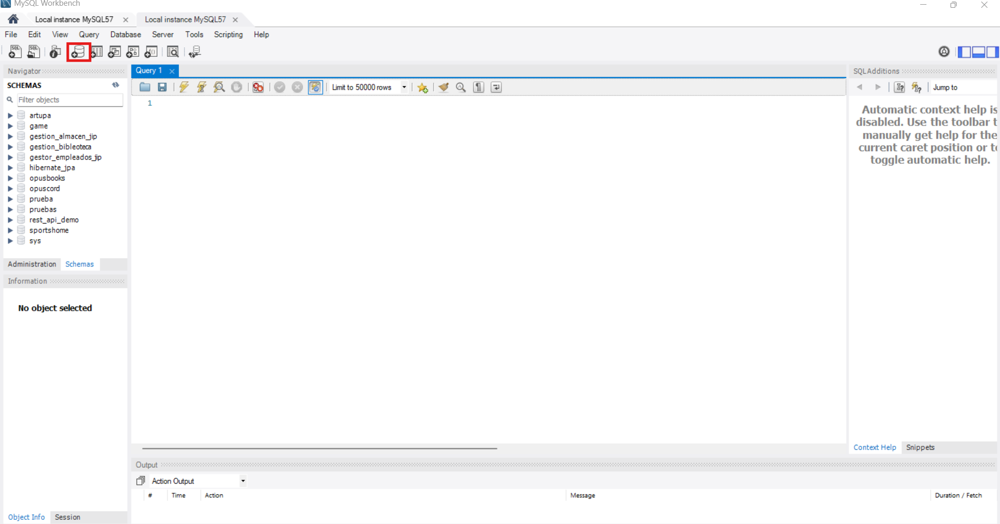
 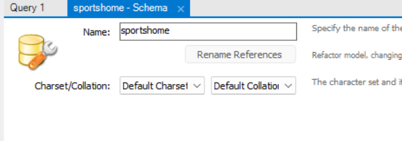
 - En una query ejecuta use sportshome y en la pestala de server clicka en la opcion de Data import y clickar en los tres puntos para buscar el archivo sportshome.sql en la carpeta de Database del proyecto.
 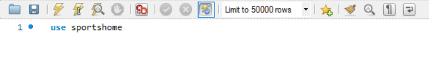
 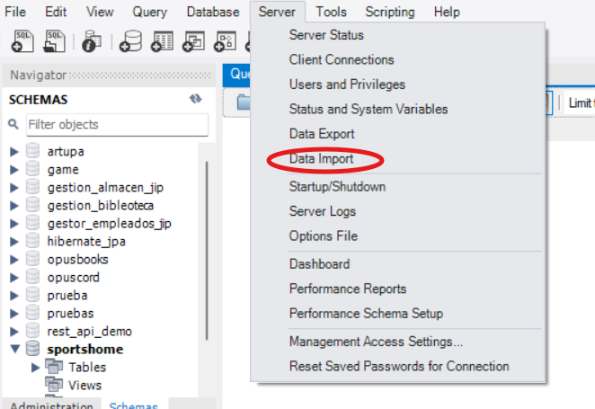
 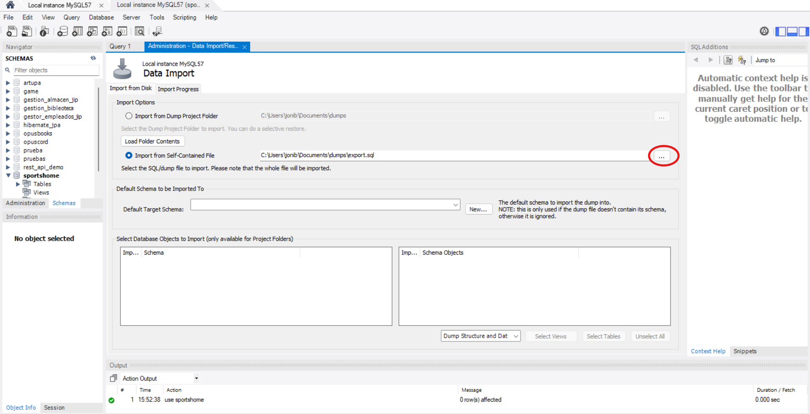
## Backend : 
 - Una vez tengamos instalado el Visual Studio 2026 vas a clickar la opcion de Abrir un proyecto o una solucion y vas a abrir el archivo que esta dentro de la capreta Backend/SportsHome llamado SportsHome.slnx
 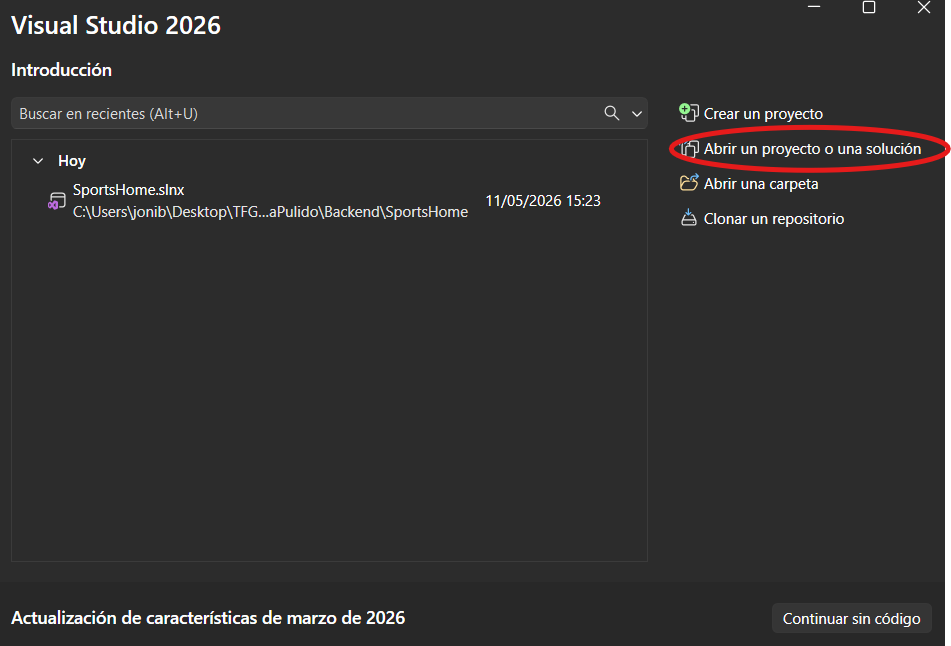
 - Cuando hayas abierto el proyecto lo que tendras que hacer es expandir la carpeta de 01.Presentacion, hacer click derecho en Sportshome.UI.API y darle a la opcion de establecer como proyecto de inicio.
 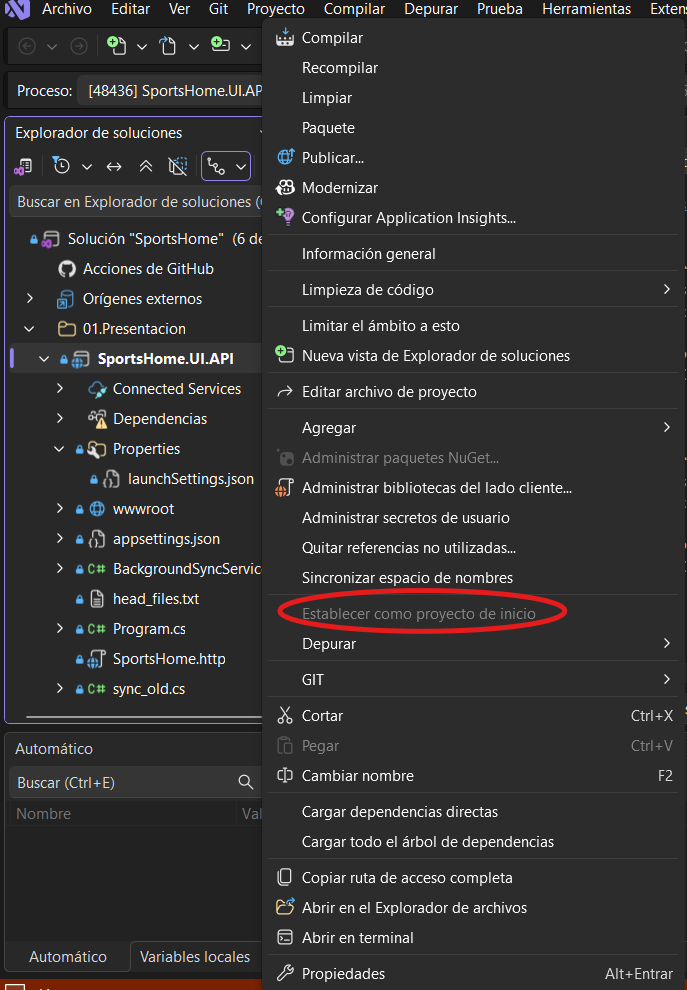
 - Una vez hayas hecho eso lo unico que tendras que hacer es configurar el siguiente archivo appsettings.json y cambiar el DefaultConnection al que necesites para tu base de datos (solo tendiras que cambiar el password si no has introducido admin como contraseña a la hora de configurar mysql)
 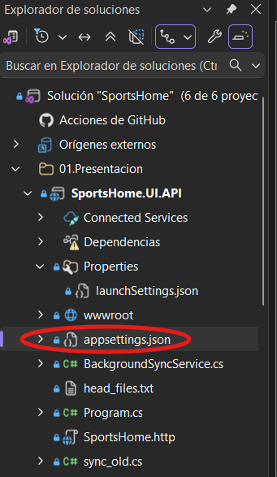
 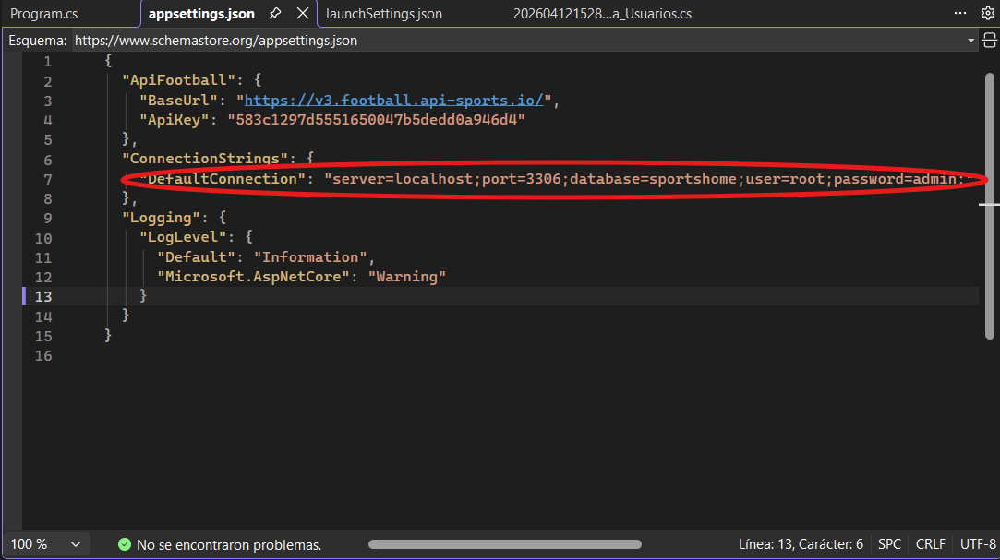
 - Con esto hecho solo tendras que ejecutar la aplicacion pulsando este boton y ya estar el back funcionando
 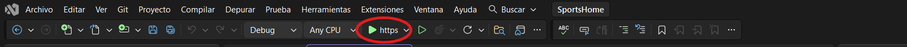
## Frontend : 
 - Hay que abrir la carpeta de SportsHome dentro de la carpeta Frontend en el proyecto un vez abramos el VSCode.
 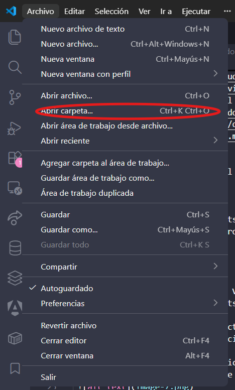
 - Luego tienes que abrir la terminal (control + ñ) y escribir los siguientes comandos
    node -v
    npm -v
    Si los dos sacan una version puedes continuar con los siguientes comandos si falla hay algo que esta bloqueando scripts en tu ordenador

    npm install
    npm install -g @angular/cli
 - Por ultimo para ejecutar el front escribiremos en la terminal "ng serve -o" y con eso ya se estaria ejecutando todo y la aplicacion estaria lista para usarse

